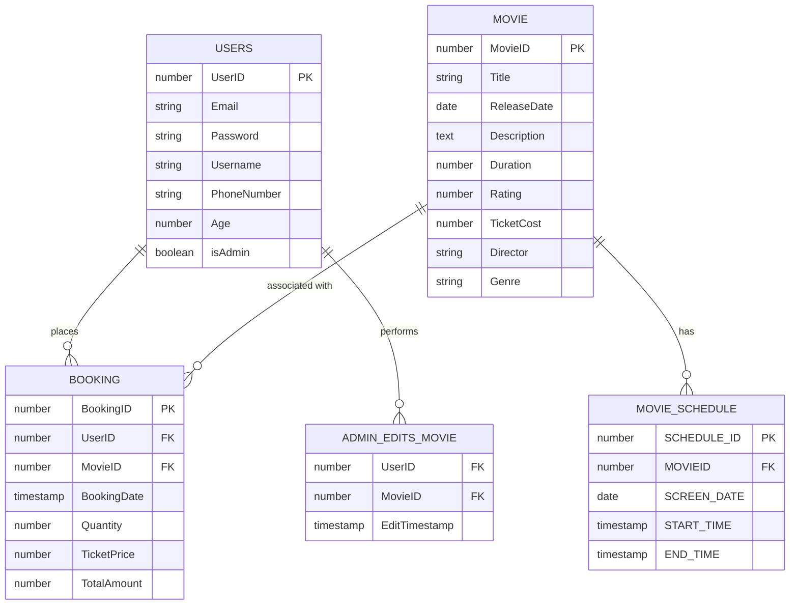

# Cinema Management System

The **Cinema Management System** is a comprehensive solution designed to streamline the management of cinema operations. It provides a user-friendly interface for both customers and administrators, enabling seamless movie browsing, booking, and management. The system ensures strong security measures, including password policies and HTTPS encryption, to protect user data.

## Features

- **User Registration & Login**: Secure account creation and authentication.
- **Movie Management**: Admins can add, edit, and delete movies.
- **Schedule Management**: Admins can manage movie schedules.
- **User Management**: Admins can add, edit, and delete users.
- **Search Functionality**: Customers can search for movies by title, genre, or date.
- **Reviews & Ratings**: Customers can rate and comment on movies.
- **History Tracking**: Customers can view their booking and interaction history.

## User Requirements

### Customer Requirements
- Search for movies.
- Register and log in using email and password.
- View and manage account details.
- Reset passwords and verify accounts.
- React to and comment on movies.
- View booking history.

### Admin Requirements
- Add, edit, and delete users.
- Add, edit, and delete movies.
- Add, edit, and delete schedules.

## Functional Requirements

### Customer Functions
- **Register**: Create an account using email, password, and name.
- **Login**: Authenticate using credentials.
- **Search Movies**: Filter movies by keywords or filters.
- **View History**: Display past bookings and interactions.
- **Manage Account**: Update account details.
- **Review Movies**: Add ratings and comments.
- **Verify Account**: Confirm email via a verification link.
- **Reset Password**: Recover account access via email.

### Admin Functions
- **Manage Users**: Add, edit, or delete user accounts.
- **Manage Movies**: Add, edit, or delete movie details.
- **Manage Schedules**: Add, edit, or delete movie schedules.

## Database Design

### Entity-Relationship Diagram (ERD)

### Tables
1. **Users**: Stores user information (UserID, Email, Password, Username, PhoneNumber, Age, isAdmin).
2. **Movie**: Stores movie details (MovieID, Title, ReleaseDate, Description, Duration, Rating, TicketCost, Director, Genre).
3. **AdminEditsMovie**: Tracks admin edits to movies (UserID, MovieID, EditTimestamp).
4. **Booking**: Manages customer bookings (BookingID, UserID, MovieID, BookingDate, Quantity, TicketPrice, TotalAmount).
5. **MOVIE_SCHEDULE**: Stores movie schedules (SCHEDULE_ID, MOVIEID, SCREEN_DATE, START_TIME, END_TIME).

## Screenshots

  

